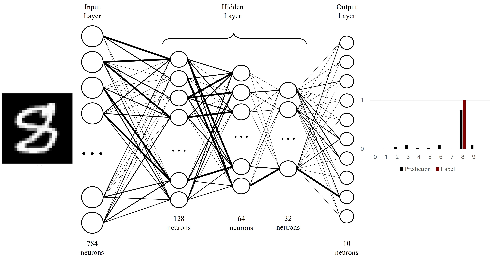
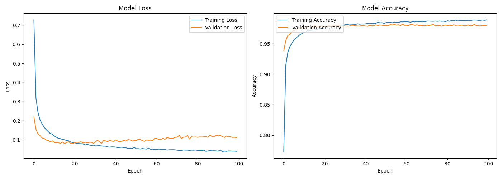
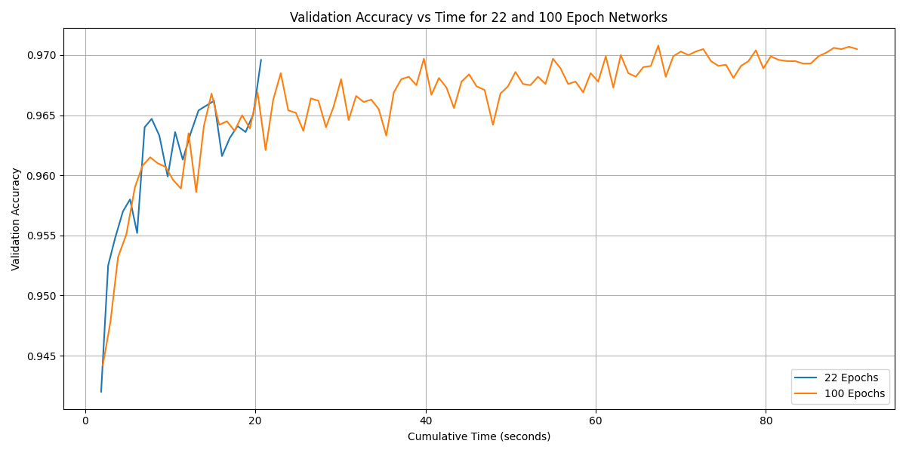

# Handwritten Digit Recognition using Neural Networks

This project explores the development and execution of a **Neural Network** for recognizing handwritten digits from the **MNIST dataset**. The MNIST dataset is a popular benchmark for machine learning models and comprises grayscale images of handwritten digits (0–9).

## Project Structure

### 1. Introduction
The project delves into artificial neural networks, drawing inspiration from the structure and functioning of the human brain to solve problems such as image classification, signal recognition, and autonomous driving.

This specific project involves constructing a neural network to recognize handwritten digits from the MNIST dataset. Despite its simplicity, the MNIST dataset remains a valuable starting point for beginners in machine learning.

### 2. Problem Description
- **Dataset**: The **MNIST** dataset consists of **60,000** training images and **10,000** test images. Each image is **28x28 pixels** in grayscale, labeled between 0 and 9.
- **Objective**: Build a neural network model that learns to recognize and classify the handwritten digits by training on the MNIST dataset and achieve a high accuracy on unseen test data.

### 3. Neural Networks Overview
- **Structure**: A neural network is composed of layers:
  - **Input Layer**: Accepts pixel values of the images.
  - **Hidden Layers**: Processes the data to detect patterns.
  - **Output Layer**: Classifies the image into one of the 10 digits.
- **Activation Functions**: Functions like ReLU and Softmax are applied at different layers to introduce non-linearity and probability-based outputs.

### 4. Model Architecture
The neural network used is a **Feed-Forward Neural Network (FNN)** with the following architecture:
- Input layer: **784 neurons** (corresponding to 28x28 pixel values).
- 1st Hidden layer: **128 neurons**, ReLU activation.
- 2nd Hidden layer: **64 neurons**, ReLU activation.
- 3rd Hidden layer: **32 neurons**, ReLU activation.
- Output layer: **10 neurons**, Softmax activation for classification into one of the 10 digits.

**Model Function & Architecture**:  



### 5. Training and Optimization
- **Loss Function**: **Categorical Cross-Entropy** was used to measure the model's error during training.
- **Optimizer**: The **Adam Optimizer** was employed with an **exponential decay learning rate** to improve convergence and minimize the loss.
- **Regularization**: **Dropout** (set at 30%) was applied to prevent overfitting.
- **Batch Size**: The model was trained using batches of **128 images**.
- **Epochs**: The network was trained over **10 epochs** initially, with experiments conducted for **100 epochs** as well.

### 6. Results
- The model achieved a **training accuracy** of 97.4% after 10 epochs. Further training up to 100 epochs yielded marginal improvements, with a final accuracy of 97.9%.
- The learning process was illustrated through loss and accuracy plots that showed significant improvement in the early epochs, with diminishing returns after extended training.

#### Key Graphs:
- **Model Loss & Accuracy**: Training and Validation Loss & Accuracy Over Epochs  
  

- **Model Accuracy**: Validation Accuracy Over Time at 22 and 100 Epochs  
  

### 7. Conclusion
The constructed neural network demonstrated strong performance on the MNIST dataset, reaching a high level of accuracy within a short number of training epochs. 

Results suggest diminishing improvements beyond a certain number of epochs, highlighting the importance of early stopping to prevent overfitting.

### 8. How to Run
1. Install dependencies: 
   ```bash
   pip install tensorflow numpy matplotlib
2. Run the training script: 
   ```bash
   python network.py
